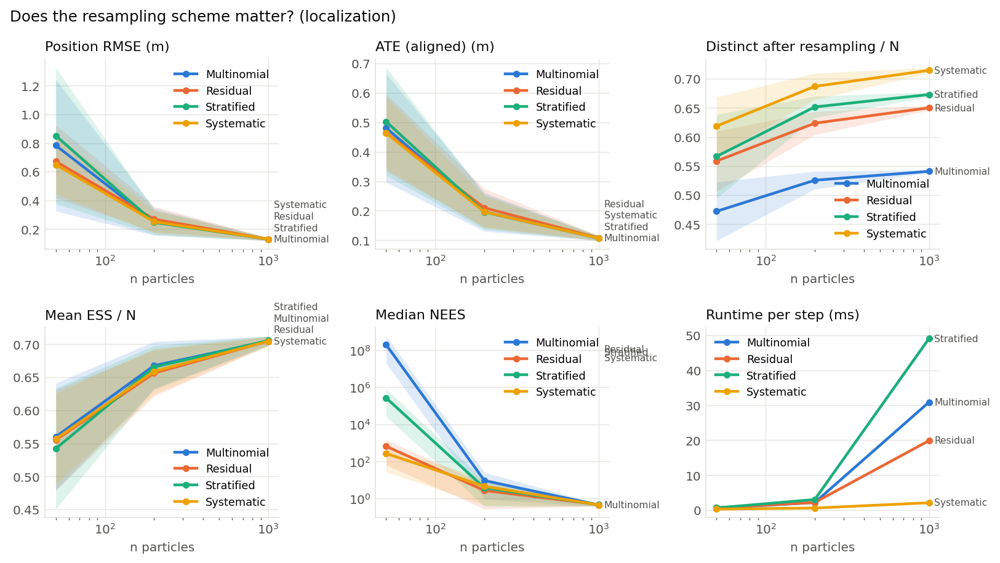

# Does the resampling scheme matter? (localization) (001)

**Question.** With everything else fixed, do multinomial, residual, stratified and systematic resampling give different localization accuracy and particle diversity?

**Hypothesis.** The lower-variance schemes (residual, stratified, systematic) keep more distinct particles and give slightly lower error than multinomial, with the biggest difference at small particle counts.

## Setup

- Result set 001
- Filter: mcl
- Fixed: proposal = motion_model, trigger = every_step
- Varied: resampler: multinomial, residual, stratified, systematic; n_particles: 50, 200, 1000
- Seeds: 20 (each seed fixes the world and the filter's randomness, the same for every variant), 240 runs

## Results

| Resampler   |   Particles |   Seeds | Position RMSE (m)   | ATE (aligned) (m)   | Distinct after resampling / N   | Mean ESS / N   | Median NEES        | Runtime per step (ms)   |
|:------------|------------:|--------:|:--------------------|:--------------------|:--------------------------------|:---------------|:-------------------|:------------------------|
| Multinomial |          50 |      20 | 0.784 ± 1           | 0.481 ± 0.42        | 0.472 ± 0.12                    | 0.56 ± 0.19    | 1.96e+08 ± 8.7e+08 | 0.554 ± 0.012           |
| Multinomial |         200 |      20 | 0.252 ± 0.22        | 0.196 ± 0.15        | 0.525 ± 0.035                   | 0.668 ± 0.083  | 9.18 ± 37          | 2.16 ± 0.029            |
| Multinomial |        1000 |      20 | 0.129 ± 0.023       | 0.107 ± 0.018       | 0.541 ± 0.0055                  | 0.705 ± 0.016  | 0.447 ± 0.16       | 30.8 ± 0.22             |
| Residual    |          50 |      20 | 0.672 ± 0.58        | 0.465 ± 0.3         | 0.558 ± 0.12                    | 0.555 ± 0.17   | 651 ± 1.9e+03      | 0.695 ± 0.03            |
| Residual    |         200 |      20 | 0.269 ± 0.2         | 0.21 ± 0.15         | 0.624 ± 0.046                   | 0.656 ± 0.08   | 2.67 ± 7.4         | 2.19 ± 0.067            |
| Residual    |        1000 |      20 | 0.13 ± 0.023        | 0.108 ± 0.018       | 0.65 ± 0.0099                   | 0.705 ± 0.016  | 0.469 ± 0.19       | 19.9 ± 0.88             |
| Stratified  |          50 |      20 | 0.851 ± 1.1         | 0.502 ± 0.42        | 0.566 ± 0.16                    | 0.542 ± 0.21   | 2.63e+05 ± 1.2e+06 | 0.633 ± 0.014           |
| Stratified  |         200 |      20 | 0.247 ± 0.2         | 0.196 ± 0.14        | 0.652 ± 0.042                   | 0.665 ± 0.074  | 3.72 ± 14          | 3.03 ± 0.017            |
| Stratified  |        1000 |      20 | 0.13 ± 0.025        | 0.107 ± 0.02        | 0.673 ± 0.0093                  | 0.706 ± 0.016  | 0.458 ± 0.17       | 49.1 ± 1.7              |
| Systematic  |          50 |      20 | 0.649 ± 0.47        | 0.463 ± 0.28        | 0.619 ± 0.11                    | 0.557 ± 0.16   | 265 ± 6.6e+02      | 0.299 ± 0.01            |
| Systematic  |         200 |      20 | 0.252 ± 0.18        | 0.196 ± 0.12        | 0.687 ± 0.052                   | 0.659 ± 0.078  | 4.51 ± 17          | 0.592 ± 0.013           |
| Systematic  |        1000 |      20 | 0.13 ± 0.025        | 0.107 ± 0.019       | 0.715 ± 0.011                   | 0.705 ± 0.016  | 0.448 ± 0.18       | 2.11 ± 0.5              |

Mean ± standard deviation over seeds.

## Findings (computed automatically)

- At n particles = 50: Position RMSE: lowest is Systematic (0.649), vs Stratified (0.851), a 24% difference, within the seed-to-seed spread (95% intervals).
- At n particles = 50: ATE (aligned): lowest is Systematic (0.463), vs Stratified (0.502), a 8% difference, within the seed-to-seed spread (95% intervals).
- At n particles = 50: Distinct after resampling / N: highest is Systematic (0.619), vs Multinomial (0.472), a 31% difference, clearly beyond the seed-to-seed spread (95% intervals).
- At n particles = 50: Mean ESS / N: highest is Multinomial (0.56), vs Stratified (0.542), a 3% difference, within the seed-to-seed spread (95% intervals).
- At n particles = 50: Median NEES: closest to the ideal 3 is Systematic (265), vs Multinomial (1.96e+08), a 100% difference, within the seed-to-seed spread (95% intervals).
- At n particles = 50: Runtime per step: lowest is Systematic (0.299), vs Residual (0.695), a 57% difference, clearly beyond the seed-to-seed spread (95% intervals).
- At n particles = 200: Position RMSE: lowest is Stratified (0.247), vs Residual (0.269), a 8% difference, within the seed-to-seed spread (95% intervals).
- At n particles = 200: ATE (aligned): lowest is Stratified (0.196), vs Residual (0.21), a 7% difference, within the seed-to-seed spread (95% intervals).
- At n particles = 200: Distinct after resampling / N: highest is Systematic (0.687), vs Multinomial (0.525), a 31% difference, clearly beyond the seed-to-seed spread (95% intervals).
- At n particles = 200: Mean ESS / N: highest is Multinomial (0.668), vs Residual (0.656), a 2% difference, within the seed-to-seed spread (95% intervals).
- At n particles = 200: Median NEES: closest to the ideal 3 is Residual (2.67), vs Multinomial (9.18), a 71% difference, within the seed-to-seed spread (95% intervals).
- At n particles = 200: Runtime per step: lowest is Systematic (0.592), vs Stratified (3.03), a 80% difference, clearly beyond the seed-to-seed spread (95% intervals).
- At n particles = 1000: Position RMSE: lowest is Multinomial (0.129), vs Systematic (0.13), a 1% difference, within the seed-to-seed spread (95% intervals).
- At n particles = 1000: ATE (aligned): lowest is Multinomial (0.107), vs Residual (0.108), a 1% difference, within the seed-to-seed spread (95% intervals).
- At n particles = 1000: Distinct after resampling / N: highest is Systematic (0.715), vs Multinomial (0.541), a 32% difference, clearly beyond the seed-to-seed spread (95% intervals).
- At n particles = 1000: Mean ESS / N: highest is Stratified (0.706), vs Systematic (0.705), a 0% difference, within the seed-to-seed spread (95% intervals).
- At n particles = 1000: Median NEES: closest to the ideal 3 is Residual (0.469), vs Multinomial (0.447), a 5% difference, within the seed-to-seed spread (95% intervals).
- At n particles = 1000: Runtime per step: lowest is Systematic (2.11), vs Stratified (49.1), a 96% difference, clearly beyond the seed-to-seed spread (95% intervals).

## Figures

