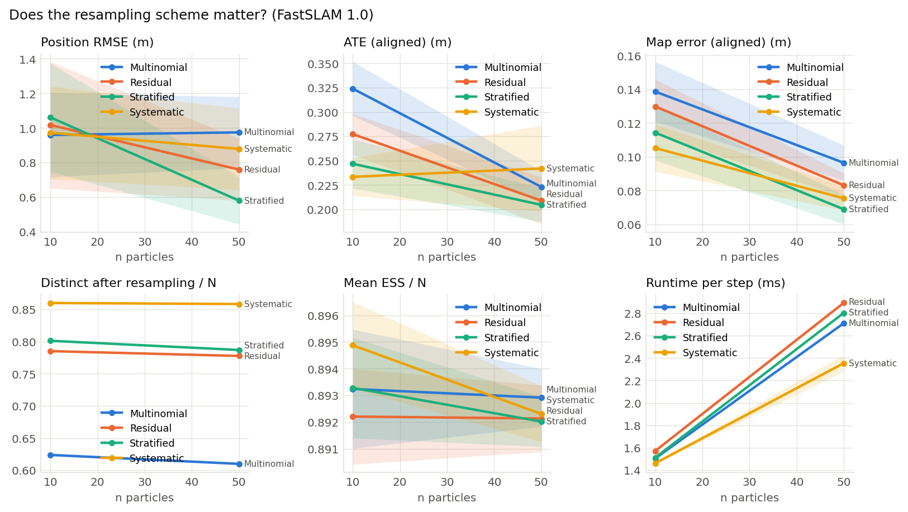

# Does the resampling scheme matter? (FastSLAM 1.0) (001)

**Question.** In FastSLAM 1.0, where each particle carries its own map, do the four resampling schemes give different pose and map accuracy or particle diversity?

**Hypothesis.** As in localization, the lower-variance schemes keep more distinct particles; because a lost map cannot be recovered, the effect on map error is larger at small particle counts.

## Setup

- Result set 001
- Filter: fastslam
- Fixed: proposal = fastslam1, trigger = every_step
- Varied: resampler: multinomial, residual, stratified, systematic; n_particles: 10, 50
- Seeds: 20 (each seed fixes the world and the filter's randomness, the same for every variant), 160 runs

## Results

| Resampler   |   Particles |   Seeds | Position RMSE (m)   | ATE (aligned) (m)   | Map error (aligned) (m)   | Distinct after resampling / N   | Mean ESS / N   | Runtime per step (ms)   |
|:------------|------------:|--------:|:--------------------|:--------------------|:--------------------------|:--------------------------------|:---------------|:------------------------|
| Multinomial |          10 |      20 | 0.96 ± 0.55         | 0.324 ± 0.064       | 0.139 ± 0.04              | 0.624 ± 0.0043                  | 0.893 ± 0.0051 | 1.5 ± 0.012             |
| Multinomial |          50 |      20 | 0.975 ± 0.47        | 0.223 ± 0.037       | 0.0965 ± 0.024            | 0.61 ± 0.002                    | 0.893 ± 0.0025 | 2.71 ± 0.01             |
| Residual    |          10 |      20 | 1.02 ± 0.84         | 0.277 ± 0.048       | 0.13 ± 0.037              | 0.785 ± 0.0024                  | 0.892 ± 0.0041 | 1.57 ± 0.018            |
| Residual    |          50 |      20 | 0.759 ± 0.41        | 0.209 ± 0.055       | 0.0832 ± 0.016            | 0.778 ± 0.0025                  | 0.892 ± 0.0028 | 2.89 ± 0.02             |
| Stratified  |          10 |      20 | 1.06 ± 0.71         | 0.247 ± 0.058       | 0.114 ± 0.037             | 0.801 ± 0.0042                  | 0.893 ± 0.0043 | 1.51 ± 0.0073           |
| Stratified  |          50 |      20 | 0.58 ± 0.31         | 0.205 ± 0.039       | 0.069 ± 0.02              | 0.787 ± 0.0016                  | 0.892 ± 0.0021 | 2.8 ± 0.0088            |
| Systematic  |          10 |      20 | 0.973 ± 0.61        | 0.233 ± 0.044       | 0.105 ± 0.032             | 0.86 ± 0.0038                   | 0.895 ± 0.0037 | 1.46 ± 0.023            |
| Systematic  |          50 |      20 | 0.879 ± 0.54        | 0.242 ± 0.1         | 0.0754 ± 0.016            | 0.858 ± 0.0019                  | 0.892 ± 0.0024 | 2.35 ± 0.17             |

Mean ± standard deviation over seeds.

## Findings (computed automatically)

- At n particles = 10: Position RMSE: lowest is Multinomial (0.96), vs Stratified (1.06), a 10% difference, within the seed-to-seed spread (95% intervals).
- At n particles = 10: ATE (aligned): lowest is Systematic (0.233), vs Multinomial (0.324), a 28% difference, clearly beyond the seed-to-seed spread (95% intervals).
- At n particles = 10: Map error (aligned): lowest is Systematic (0.105), vs Multinomial (0.139), a 24% difference, clearly beyond the seed-to-seed spread (95% intervals).
- At n particles = 10: Distinct after resampling / N: highest is Systematic (0.86), vs Multinomial (0.624), a 38% difference, clearly beyond the seed-to-seed spread (95% intervals).
- At n particles = 10: Mean ESS / N: highest is Systematic (0.895), vs Residual (0.892), a 0% difference, within the seed-to-seed spread (95% intervals).
- At n particles = 10: Runtime per step: lowest is Systematic (1.46), vs Residual (1.57), a 7% difference, clearly beyond the seed-to-seed spread (95% intervals).
- At n particles = 50: Position RMSE: lowest is Stratified (0.58), vs Multinomial (0.975), a 41% difference, clearly beyond the seed-to-seed spread (95% intervals).
- At n particles = 50: ATE (aligned): lowest is Stratified (0.205), vs Systematic (0.242), a 15% difference, within the seed-to-seed spread (95% intervals).
- At n particles = 50: Map error (aligned): lowest is Stratified (0.069), vs Multinomial (0.0965), a 28% difference, clearly beyond the seed-to-seed spread (95% intervals).
- At n particles = 50: Distinct after resampling / N: highest is Systematic (0.858), vs Multinomial (0.61), a 41% difference, clearly beyond the seed-to-seed spread (95% intervals).
- At n particles = 50: Mean ESS / N: highest is Multinomial (0.893), vs Stratified (0.892), a 0% difference, within the seed-to-seed spread (95% intervals).
- At n particles = 50: Runtime per step: lowest is Systematic (2.35), vs Residual (2.89), a 19% difference, clearly beyond the seed-to-seed spread (95% intervals).

## Figures

