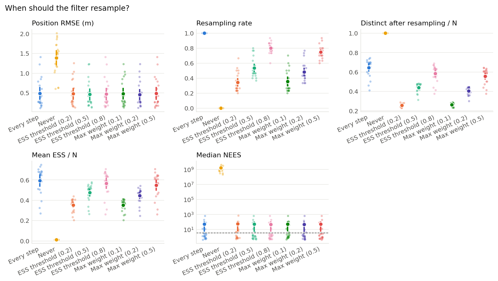
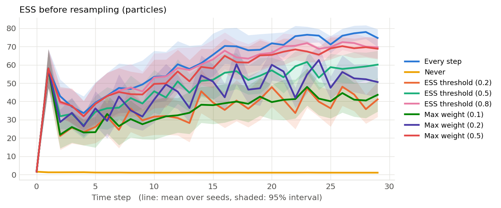
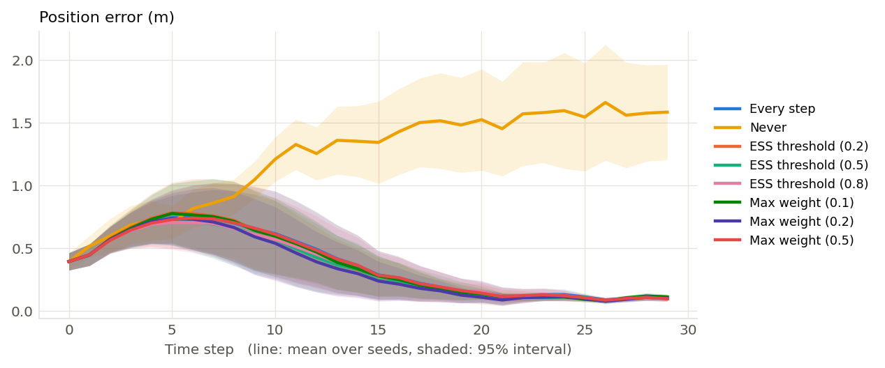

# When should the filter resample? (001)

**Question.** Is it better to resample every step, never, or only when the particles degenerate (measured by the effective sample size (ESS) or by the largest weight), and how much does the threshold matter?

**Hypothesis.** Never resampling collapses onto a few particles and loses track. Resampling every step keeps track but wastes diversity. An ESS threshold around 0.5 gives the lowest error with the fewest resampling steps; the max-weight rule behaves similarly but is more sensitive to its threshold.

## Setup

- Result set 001
- Filter: mcl
- Fixed: n_particles = 100, proposal = motion_model, resampler = systematic
- Varied: trigger: every_step, never, ess_threshold (threshold=0.2), ess_threshold (threshold=0.5), ess_threshold (threshold=0.8), max_weight (threshold=0.1), max_weight (threshold=0.2), max_weight (threshold=0.5)
- Seeds: 20 (each seed fixes the world and the filter's randomness, the same for every variant), 160 runs

## Results

| Variant             |   Seeds | Position RMSE (m)   | Resampling rate   | Distinct after resampling / N   | Mean ESS / N     | Median NEES       |
|:--------------------|--------:|:--------------------|:------------------|:--------------------------------|:-----------------|:------------------|
| Every step          |      20 | 0.485 ± 0.37        | 1 ± 0             | 0.642 ± 0.093                   | 0.591 ± 0.14     | 46.1 ± 1.4e+02    |
| Never               |      20 | 1.39 ± 0.44         | 0 ± 0             | 1 ± 0                           | 0.0106 ± 0.00049 | 1.6e+09 ± 1.1e+09 |
| ESS threshold (0.2) |      20 | 0.474 ± 0.34        | 0.342 ± 0.13      | 0.254 ± 0.017                   | 0.351 ± 0.064    | 50.5 ± 1.5e+02    |
| ESS threshold (0.5) |      20 | 0.458 ± 0.34        | 0.535 ± 0.13      | 0.438 ± 0.046                   | 0.474 ± 0.089    | 45.9 ± 1.4e+02    |
| ESS threshold (0.8) |      20 | 0.466 ± 0.36        | 0.8 ± 0.075       | 0.582 ± 0.089                   | 0.565 ± 0.13     | 45.6 ± 1.4e+02    |
| Max weight (0.1)    |      20 | 0.477 ± 0.34        | 0.353 ± 0.15      | 0.261 ± 0.018                   | 0.352 ± 0.059    | 48.2 ± 1.4e+02    |
| Max weight (0.2)    |      20 | 0.452 ± 0.32        | 0.483 ± 0.13      | 0.402 ± 0.04                    | 0.444 ± 0.077    | 43.3 ± 1.4e+02    |
| Max weight (0.5)    |      20 | 0.483 ± 0.37        | 0.747 ± 0.087     | 0.556 ± 0.08                    | 0.547 ± 0.12     | 46 ± 1.4e+02      |

Mean ± standard deviation over seeds.

## Findings (computed automatically)

- clear differences in Position RMSE (Max weight (0.2) 0.452 vs Never 1.39, 67%), Distinct after resampling / N (Never 1 vs ESS threshold (0.2) 0.254, 294%), Mean ESS / N (Every step 0.591 vs Never 0.0106, 5493%) and Median NEES (Max weight (0.2) 43.3 vs Never 1.6e+09, 100%).

## Notes

- 160 of 160 runs were made with a different version of the code than the current one.

## Figures

