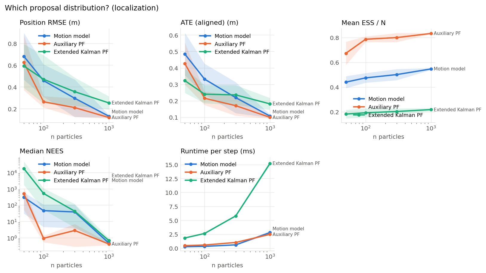

# Which proposal distribution? (localization) (001)

**Question.** Does sampling from a proposal that uses the measurement (auxiliary particle filter, extended Kalman particle filter) beat sampling from the motion model, and at which particle counts?

**Hypothesis.** Measurement-aware proposals put particles where the likelihood is high, so they reach a given error with fewer particles, at a higher cost per particle. The extended Kalman proposal needs enough particles to cover the uniform start.

## Setup

- Result set 001
- Filter: mcl
- Fixed: resampler = systematic, trigger = ess_threshold (threshold=0.5)
- Varied: proposal: motion_model, auxiliary, extended_kalman; n_particles: 50, 100, 300, 1000
- Seeds: 20 (each seed fixes the world and the filter's randomness, the same for every variant), 240 runs

## Results

| Proposal           |   Particles |   Seeds | Position RMSE (m)   | ATE (aligned) (m)   | Mean ESS / N   | Median NEES        | Runtime per step (ms)   |
|:-------------------|------------:|--------:|:--------------------|:--------------------|:---------------|:-------------------|:------------------------|
| Motion model       |          50 |      20 | 0.682 ± 0.49        | 0.484 ± 0.29        | 0.44 ± 0.11    | 304 ± 6.7e+02      | 0.256 ± 0.027           |
| Motion model       |         100 |      20 | 0.458 ± 0.34        | 0.332 ± 0.21        | 0.474 ± 0.089  | 45.9 ± 1.4e+02     | 0.318 ± 0.028           |
| Motion model       |         300 |      20 | 0.296 ± 0.39        | 0.219 ± 0.22        | 0.5 ± 0.1      | 38 ± 1.6e+02       | 0.588 ± 0.062           |
| Motion model       |        1000 |      20 | 0.131 ± 0.027       | 0.107 ± 0.021       | 0.546 ± 0.017  | 0.461 ± 0.16       | 2.79 ± 0.72             |
| Auxiliary PF       |          50 |      20 | 0.624 ± 0.58        | 0.426 ± 0.29        | 0.673 ± 0.21   | 515 ± 1.5e+03      | 0.45 ± 0.041            |
| Auxiliary PF       |         100 |      20 | 0.264 ± 0.12        | 0.215 ± 0.093       | 0.786 ± 0.053  | 0.919 ± 0.88       | 0.56 ± 0.023            |
| Auxiliary PF       |         300 |      20 | 0.21 ± 0.19         | 0.17 ± 0.14         | 0.799 ± 0.084  | 2.78 ± 9.5         | 1.02 ± 0.054            |
| Auxiliary PF       |        1000 |      20 | 0.119 ± 0.017       | 0.0991 ± 0.014      | 0.833 ± 0.011  | 0.411 ± 0.15       | 2.48 ± 0.031            |
| Extended Kalman PF |          50 |      20 | 0.592 ± 0.46        | 0.322 ± 0.17        | 0.182 ± 0.079  | 1.76e+04 ± 7.1e+04 | 1.83 ± 0.024            |
| Extended Kalman PF |         100 |      20 | 0.47 ± 0.5          | 0.24 ± 0.13         | 0.192 ± 0.083  | 522 ± 1.3e+03      | 2.63 ± 0.046            |
| Extended Kalman PF |         300 |      20 | 0.356 ± 0.29        | 0.236 ± 0.13        | 0.202 ± 0.057  | 42.3 ± 1.7e+02     | 5.79 ± 0.14             |
| Extended Kalman PF |        1000 |      20 | 0.253 ± 0.14        | 0.181 ± 0.083       | 0.218 ± 0.026  | 0.667 ± 0.65       | 15.2 ± 0.87             |

Mean ± standard deviation over seeds.

## Findings (computed automatically)

- At n particles = 50: Position RMSE: lowest is Extended Kalman PF (0.592), vs Motion model (0.682), a 13% difference, within the seed-to-seed spread (95% intervals).
- At n particles = 50: ATE (aligned): lowest is Extended Kalman PF (0.322), vs Motion model (0.484), a 33% difference, within the seed-to-seed spread (95% intervals).
- At n particles = 50: Mean ESS / N: highest is Auxiliary PF (0.673), vs Extended Kalman PF (0.182), a 270% difference, clearly beyond the seed-to-seed spread (95% intervals).
- At n particles = 50: Median NEES: closest to the ideal 3 is Motion model (304), vs Extended Kalman PF (1.76e+04), a 98% difference, within the seed-to-seed spread (95% intervals).
- At n particles = 50: Runtime per step: lowest is Motion model (0.256), vs Extended Kalman PF (1.83), a 86% difference, clearly beyond the seed-to-seed spread (95% intervals).
- At n particles = 100: Position RMSE: lowest is Auxiliary PF (0.264), vs Extended Kalman PF (0.47), a 44% difference, within the seed-to-seed spread (95% intervals).
- At n particles = 100: ATE (aligned): lowest is Auxiliary PF (0.215), vs Motion model (0.332), a 35% difference, within the seed-to-seed spread (95% intervals).
- At n particles = 100: Mean ESS / N: highest is Auxiliary PF (0.786), vs Extended Kalman PF (0.192), a 310% difference, clearly beyond the seed-to-seed spread (95% intervals).
- At n particles = 100: Median NEES: closest to the ideal 3 is Auxiliary PF (0.919), vs Extended Kalman PF (522), a 100% difference, within the seed-to-seed spread (95% intervals).
- At n particles = 100: Runtime per step: lowest is Motion model (0.318), vs Extended Kalman PF (2.63), a 88% difference, clearly beyond the seed-to-seed spread (95% intervals).
- At n particles = 300: Position RMSE: lowest is Auxiliary PF (0.21), vs Extended Kalman PF (0.356), a 41% difference, within the seed-to-seed spread (95% intervals).
- At n particles = 300: ATE (aligned): lowest is Auxiliary PF (0.17), vs Extended Kalman PF (0.236), a 28% difference, within the seed-to-seed spread (95% intervals).
- At n particles = 300: Mean ESS / N: highest is Auxiliary PF (0.799), vs Extended Kalman PF (0.202), a 295% difference, clearly beyond the seed-to-seed spread (95% intervals).
- At n particles = 300: Median NEES: closest to the ideal 3 is Auxiliary PF (2.78), vs Extended Kalman PF (42.3), a 93% difference, within the seed-to-seed spread (95% intervals).
- At n particles = 300: Runtime per step: lowest is Motion model (0.588), vs Extended Kalman PF (5.79), a 90% difference, clearly beyond the seed-to-seed spread (95% intervals).
- At n particles = 1000: Position RMSE: lowest is Auxiliary PF (0.119), vs Extended Kalman PF (0.253), a 53% difference, clearly beyond the seed-to-seed spread (95% intervals).
- At n particles = 1000: ATE (aligned): lowest is Auxiliary PF (0.0991), vs Extended Kalman PF (0.181), a 45% difference, clearly beyond the seed-to-seed spread (95% intervals).
- At n particles = 1000: Mean ESS / N: highest is Auxiliary PF (0.833), vs Extended Kalman PF (0.218), a 283% difference, clearly beyond the seed-to-seed spread (95% intervals).
- At n particles = 1000: Median NEES: closest to the ideal 3 is Extended Kalman PF (0.667), vs Auxiliary PF (0.411), a 62% difference, within the seed-to-seed spread (95% intervals).
- At n particles = 1000: Runtime per step: lowest is Auxiliary PF (2.48), vs Extended Kalman PF (15.2), a 84% difference, clearly beyond the seed-to-seed spread (95% intervals).

## Figures

