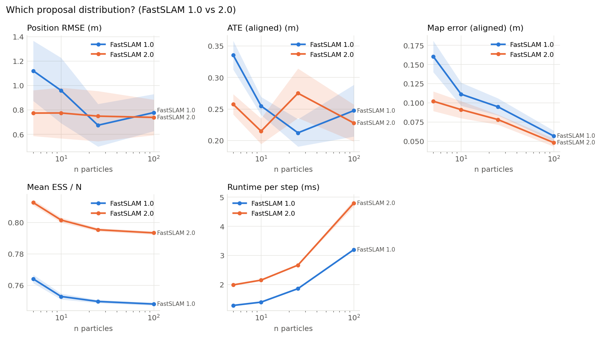

# Which proposal distribution? (FastSLAM 1.0 vs 2.0) (001)

**Question.** Does FastSLAM 2.0, which samples the pose from a proposal that includes the current observation, give better pose and map estimates than FastSLAM 1.0, and does the advantage shrink with more particles?

**Hypothesis.** FastSLAM 2.0 is more accurate and keeps a higher ESS, especially with few particles, at a higher runtime per step (Montemerlo et al., 2003).

## Setup

- Result set 001
- Filter: fastslam
- Fixed: resampler = systematic
- Varied: proposal: fastslam1, fastslam2; n_particles: 5, 10, 25, 100
- Seeds: 20 (each seed fixes the world and the filter's randomness, the same for every variant), 160 runs

## Results

| Proposal     |   Particles |   Seeds | Position RMSE (m)   | ATE (aligned) (m)   | Map error (aligned) (m)   | Mean ESS / N   | Runtime per step (ms)   |
|:-------------|------------:|--------:|:--------------------|:--------------------|:--------------------------|:---------------|:------------------------|
| FastSLAM 1.0 |           5 |      20 | 1.12 ± 0.56         | 0.335 ± 0.052       | 0.16 ± 0.047              | 0.764 ± 0.0061 | 1.28 ± 0.0076           |
| FastSLAM 1.0 |          10 |      20 | 0.958 ± 0.61        | 0.255 ± 0.033       | 0.111 ± 0.034             | 0.753 ± 0.0043 | 1.39 ± 0.0064           |
| FastSLAM 1.0 |          25 |      20 | 0.673 ± 0.4         | 0.212 ± 0.05        | 0.0946 ± 0.025            | 0.75 ± 0.0023  | 1.86 ± 0.013            |
| FastSLAM 1.0 |         100 |      20 | 0.777 ± 0.35        | 0.247 ± 0.094       | 0.0565 ± 0.016            | 0.748 ± 0.0022 | 3.19 ± 0.018            |
| FastSLAM 2.0 |           5 |      20 | 0.773 ± 0.43        | 0.257 ± 0.037       | 0.102 ± 0.029             | 0.813 ± 0.0042 | 1.98 ± 0.013            |
| FastSLAM 2.0 |          10 |      20 | 0.774 ± 0.47        | 0.215 ± 0.046       | 0.0909 ± 0.026            | 0.802 ± 0.0038 | 2.15 ± 0.012            |
| FastSLAM 2.0 |          25 |      20 | 0.748 ± 0.47        | 0.275 ± 0.089       | 0.078 ± 0.015             | 0.795 ± 0.0025 | 2.66 ± 0.028            |
| FastSLAM 2.0 |         100 |      20 | 0.737 ± 0.33        | 0.228 ± 0.067       | 0.0479 ± 0.012            | 0.793 ± 0.0024 | 4.79 ± 0.27             |

Mean ± standard deviation over seeds.

## Findings (computed automatically)

- At n particles = 5: Position RMSE: lowest is FastSLAM 2.0 (0.773), vs FastSLAM 1.0 (1.12), a 31% difference, within the seed-to-seed spread (95% intervals).
- At n particles = 5: ATE (aligned): lowest is FastSLAM 2.0 (0.257), vs FastSLAM 1.0 (0.335), a 23% difference, clearly beyond the seed-to-seed spread (95% intervals).
- At n particles = 5: Map error (aligned): lowest is FastSLAM 2.0 (0.102), vs FastSLAM 1.0 (0.16), a 36% difference, clearly beyond the seed-to-seed spread (95% intervals).
- At n particles = 5: Mean ESS / N: highest is FastSLAM 2.0 (0.813), vs FastSLAM 1.0 (0.764), a 6% difference, clearly beyond the seed-to-seed spread (95% intervals).
- At n particles = 5: Runtime per step: lowest is FastSLAM 1.0 (1.28), vs FastSLAM 2.0 (1.98), a 36% difference, clearly beyond the seed-to-seed spread (95% intervals).
- At n particles = 10: Position RMSE: lowest is FastSLAM 2.0 (0.774), vs FastSLAM 1.0 (0.958), a 19% difference, within the seed-to-seed spread (95% intervals).
- At n particles = 10: ATE (aligned): lowest is FastSLAM 2.0 (0.215), vs FastSLAM 1.0 (0.255), a 16% difference, clearly beyond the seed-to-seed spread (95% intervals).
- At n particles = 10: Map error (aligned): lowest is FastSLAM 2.0 (0.0909), vs FastSLAM 1.0 (0.111), a 18% difference, within the seed-to-seed spread (95% intervals).
- At n particles = 10: Mean ESS / N: highest is FastSLAM 2.0 (0.802), vs FastSLAM 1.0 (0.753), a 6% difference, clearly beyond the seed-to-seed spread (95% intervals).
- At n particles = 10: Runtime per step: lowest is FastSLAM 1.0 (1.39), vs FastSLAM 2.0 (2.15), a 35% difference, clearly beyond the seed-to-seed spread (95% intervals).
- At n particles = 25: Position RMSE: lowest is FastSLAM 1.0 (0.673), vs FastSLAM 2.0 (0.748), a 10% difference, within the seed-to-seed spread (95% intervals).
- At n particles = 25: ATE (aligned): lowest is FastSLAM 1.0 (0.212), vs FastSLAM 2.0 (0.275), a 23% difference, clearly beyond the seed-to-seed spread (95% intervals).
- At n particles = 25: Map error (aligned): lowest is FastSLAM 2.0 (0.078), vs FastSLAM 1.0 (0.0946), a 18% difference, within the seed-to-seed spread (95% intervals).
- At n particles = 25: Mean ESS / N: highest is FastSLAM 2.0 (0.795), vs FastSLAM 1.0 (0.75), a 6% difference, clearly beyond the seed-to-seed spread (95% intervals).
- At n particles = 25: Runtime per step: lowest is FastSLAM 1.0 (1.86), vs FastSLAM 2.0 (2.66), a 30% difference, clearly beyond the seed-to-seed spread (95% intervals).
- At n particles = 100: Position RMSE: lowest is FastSLAM 2.0 (0.737), vs FastSLAM 1.0 (0.777), a 5% difference, within the seed-to-seed spread (95% intervals).
- At n particles = 100: ATE (aligned): lowest is FastSLAM 2.0 (0.228), vs FastSLAM 1.0 (0.247), a 8% difference, within the seed-to-seed spread (95% intervals).
- At n particles = 100: Map error (aligned): lowest is FastSLAM 2.0 (0.0479), vs FastSLAM 1.0 (0.0565), a 15% difference, within the seed-to-seed spread (95% intervals).
- At n particles = 100: Mean ESS / N: highest is FastSLAM 2.0 (0.793), vs FastSLAM 1.0 (0.748), a 6% difference, clearly beyond the seed-to-seed spread (95% intervals).
- At n particles = 100: Runtime per step: lowest is FastSLAM 1.0 (3.19), vs FastSLAM 2.0 (4.79), a 33% difference, clearly beyond the seed-to-seed spread (95% intervals).

## Figures

