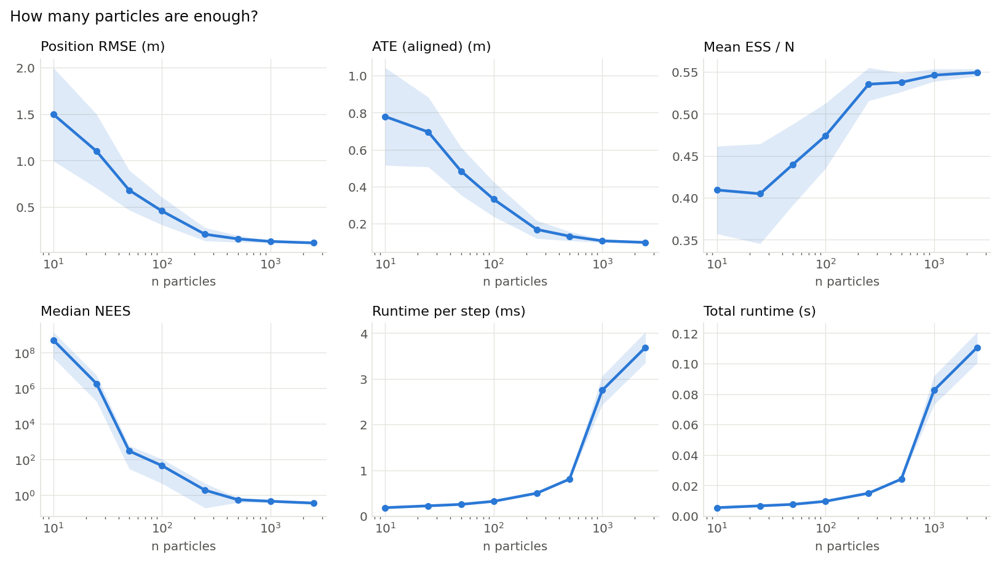
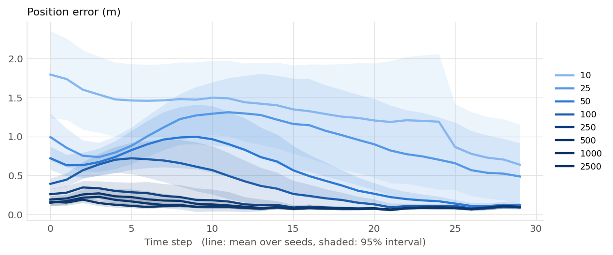

# How many particles are enough? (001)

**Question.** How do localization error, particle diversity and runtime change with the number of particles, and where do more particles stop helping?

**Hypothesis.** Error falls quickly and then levels off, while runtime grows linearly with N, so there is a clear point of diminishing returns.

## Setup

- Result set 001
- Filter: mcl
- Fixed: proposal = motion_model, resampler = systematic, trigger = ess_threshold (threshold=0.5)
- Varied: n_particles: 10, 25, 50, 100, 250, 500, 1000, 2500
- Seeds: 20 (each seed fixes the world and the filter's randomness, the same for every variant), 160 runs

## Results

|   Variant |   Seeds | Position RMSE (m)   | ATE (aligned) (m)   | Mean ESS / N   | Median NEES        | Runtime per step (ms)   | Total runtime (s)   |
|----------:|--------:|:--------------------|:--------------------|:---------------|:-------------------|:------------------------|:--------------------|
|        10 |      20 | 1.5 ± 1.1           | 0.779 ± 0.6         | 0.409 ± 0.12   | 5.08e+08 ± 2.1e+09 | 0.182 ± 0.017           | 0.00546 ± 0.00052   |
|        25 |      20 | 1.1 ± 0.91          | 0.695 ± 0.43        | 0.405 ± 0.14   | 1.83e+06 ± 8.2e+06 | 0.222 ± 0.019           | 0.00666 ± 0.00057   |
|        50 |      20 | 0.682 ± 0.49        | 0.484 ± 0.29        | 0.44 ± 0.11    | 304 ± 6.7e+02      | 0.254 ± 0.026           | 0.00763 ± 0.00079   |
|       100 |      20 | 0.458 ± 0.34        | 0.332 ± 0.21        | 0.474 ± 0.089  | 45.9 ± 1.4e+02     | 0.321 ± 0.032           | 0.00963 ± 0.00097   |
|       250 |      20 | 0.208 ± 0.16        | 0.168 ± 0.11        | 0.535 ± 0.045  | 1.92 ± 6.2         | 0.499 ± 0.031           | 0.015 ± 0.00092     |
|       500 |      20 | 0.158 ± 0.083       | 0.132 ± 0.057       | 0.538 ± 0.026  | 0.562 ± 0.39       | 0.807 ± 0.035           | 0.0242 ± 0.0011     |
|      1000 |      20 | 0.131 ± 0.027       | 0.107 ± 0.021       | 0.546 ± 0.017  | 0.461 ± 0.16       | 2.75 ± 0.72             | 0.0824 ± 0.022      |
|      2500 |      20 | 0.115 ± 0.018       | 0.0981 ± 0.015      | 0.549 ± 0.01   | 0.362 ± 0.13       | 3.69 ± 0.77             | 0.111 ± 0.023       |

Mean ± standard deviation over seeds.

## Findings (computed automatically)

- Position RMSE: lowest is 2500 (0.115), vs 10 (1.5), a 92% difference, clearly beyond the seed-to-seed spread (95% intervals).
- ATE (aligned): lowest is 2500 (0.0981), vs 10 (0.779), a 87% difference, clearly beyond the seed-to-seed spread (95% intervals).
- Mean ESS / N: highest is 2500 (0.549), vs 25 (0.405), a 36% difference, clearly beyond the seed-to-seed spread (95% intervals).
- Median NEES: closest to the ideal 3 is 250 (1.92), vs 10 (5.08e+08), a 100% difference, within the seed-to-seed spread (95% intervals).
- Runtime per step: lowest is 10 (0.182), vs 2500 (3.69), a 95% difference, clearly beyond the seed-to-seed spread (95% intervals).
- Total runtime: lowest is 10 (0.00546), vs 2500 (0.111), a 95% difference, clearly beyond the seed-to-seed spread (95% intervals).

## Figures

