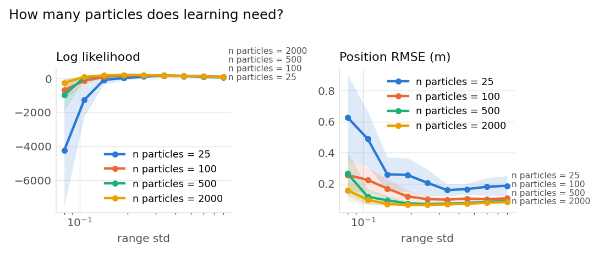
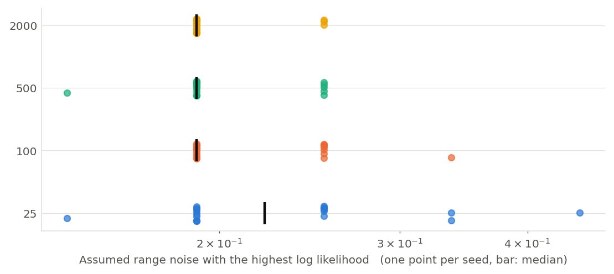

# How many particles does learning need? (001)

**Question.** The same sweep of the assumed range noise, run with different numbers of particles. How does the number of particles change the log likelihood, how widely the estimate scatters between recordings, and whether the true value (0.2 m) is picked out at all?

**Hypothesis.** The likelihood is estimated from the particle weights, so few particles make it noisy and biased low, and the peak is buried in that noise. The estimate should settle on the true value and the recordings should start to agree once there are enough particles to represent the belief.

## Setup

- Result set 001
- Filter: mcl
- Fixed: proposal = motion_model, resampler = systematic, trigger = ess_threshold (threshold=0.5), start = known, bearing_std = 0.05, forward_std = 0.005, turn_std = 0.002
- Varied: n_particles: 25, 100, 500, 2000; range_std: 0.08, 0.107, 0.142, 0.19, 0.253, 0.337, 0.45, 0.6, 0.8
- Seeds: 20 (each seed fixes the world and the filter's randomness, the same for every variant), 720 runs

## Results

|   Particles |   Assumed range noise |   Seeds | Log likelihood      | Position RMSE (m)   |
|------------:|----------------------:|--------:|:--------------------|:--------------------|
|          25 |                 0.08  |      20 | -4.25e+03 ± 7.5e+03 | 0.627 ± 0.62        |
|          25 |                 0.107 |      20 | -1.26e+03 ± 2.2e+03 | 0.488 ± 0.41        |
|          25 |                 0.142 |      20 | -77.7 ± 5.7e+02     | 0.26 ± 0.25         |
|          25 |                 0.19  |      20 | 27.8 ± 3.2e+02      | 0.256 ± 0.25        |
|          25 |                 0.253 |      20 | 120 ± 1.9e+02       | 0.206 ± 0.2         |
|          25 |                 0.337 |      20 | 159 ± 26            | 0.158 ± 0.087       |
|          25 |                 0.45  |      20 | 141 ± 18            | 0.165 ± 0.082       |
|          25 |                 0.6   |      20 | 105 ± 54            | 0.18 ± 0.13         |
|          25 |                 0.8   |      20 | 70.5 ± 72           | 0.186 ± 0.15        |
|         100 |                 0.08  |      20 | -676 ± 1.2e+03      | 0.256 ± 0.23        |
|         100 |                 0.107 |      20 | -137 ± 4.3e+02      | 0.224 ± 0.18        |
|         100 |                 0.142 |      20 | 97 ± 1.8e+02        | 0.168 ± 0.14        |
|         100 |                 0.19  |      20 | 184 ± 65            | 0.118 ± 0.089       |
|         100 |                 0.253 |      20 | 194 ± 14            | 0.1 ± 0.039         |
|         100 |                 0.337 |      20 | 179 ± 8.8           | 0.0968 ± 0.034      |
|         100 |                 0.45  |      20 | 154 ± 8.7           | 0.103 ± 0.036       |
|         100 |                 0.6   |      20 | 127 ± 7.2           | 0.0992 ± 0.027      |
|         100 |                 0.8   |      20 | 95 ± 7.3            | 0.106 ± 0.032       |
|         500 |                 0.08  |      20 | -966 ± 2.2e+03      | 0.265 ± 0.32        |
|         500 |                 0.107 |      20 | 57.5 ± 2.3e+02      | 0.116 ± 0.12        |
|         500 |                 0.142 |      20 | 170 ± 60            | 0.0929 ± 0.069      |
|         500 |                 0.19  |      20 | 203 ± 16            | 0.0725 ± 0.027      |
|         500 |                 0.253 |      20 | 200 ± 9.4           | 0.069 ± 0.018       |
|         500 |                 0.337 |      20 | 183 ± 6.7           | 0.0715 ± 0.019      |
|         500 |                 0.45  |      20 | 158 ± 5.8           | 0.0756 ± 0.019      |
|         500 |                 0.6   |      20 | 129 ± 5.6           | 0.0823 ± 0.022      |
|         500 |                 0.8   |      20 | 97.6 ± 5            | 0.0872 ± 0.023      |
|        2000 |                 0.08  |      20 | -252 ± 5.6e+02      | 0.157 ± 0.15        |
|        2000 |                 0.107 |      20 | 99.1 ± 90           | 0.0961 ± 0.067      |
|        2000 |                 0.142 |      20 | 185 ± 24            | 0.0692 ± 0.025      |
|        2000 |                 0.19  |      20 | 205 ± 13            | 0.0629 ± 0.017      |
|        2000 |                 0.253 |      20 | 201 ± 8.7           | 0.0629 ± 0.017      |
|        2000 |                 0.337 |      20 | 183 ± 6.5           | 0.0663 ± 0.018      |
|        2000 |                 0.45  |      20 | 158 ± 5.7           | 0.0711 ± 0.018      |
|        2000 |                 0.6   |      20 | 129 ± 5.6           | 0.0768 ± 0.019      |
|        2000 |                 0.8   |      20 | 98 ± 5.7            | 0.0824 ± 0.02       |

Mean ± standard deviation over seeds.

## Estimate from each recording on its own

|   Particles |   Seeds |   Best assumed range noise (median) | Range over seeds   | Seeds at the median   |
|------------:|--------:|------------------------------------:|:-------------------|:----------------------|
|          25 |      20 |                              0.2215 | 0.142 to 0.45      | 0 of 20               |
|         100 |      20 |                              0.19   | 0.19 to 0.337      | 12 of 20              |
|         500 |      20 |                              0.19   | 0.142 to 0.253     | 14 of 20              |
|        2000 |      20 |                              0.19   | 0.19 to 0.253      | 17 of 20              |

The value of the swept setting with the highest log likelihood within each seed's runs.

## Findings (computed automatically)

- At range std = 0.08: clear differences in Log likelihood (2000 -252 vs 25 -4.25e+03, 94%) and Position RMSE (2000 0.157 vs 25 0.627, 75%).
- At range std = 0.107: clear differences in Log likelihood (2000 99.1 vs 25 -1.26e+03, 108%) and Position RMSE (2000 0.0961 vs 25 0.488, 80%).
- At range std = 0.142: clear differences in Log likelihood (2000 185 vs 25 -77.7, 338%) and Position RMSE (2000 0.0692 vs 25 0.26, 73%).
- At range std = 0.19: clear differences in Log likelihood (2000 205 vs 25 27.8, 638%) and Position RMSE (2000 0.0629 vs 25 0.256, 75%).
- At range std = 0.253: clear differences in Position RMSE (2000 0.0629 vs 25 0.206, 69%).
- At range std = 0.253: no difference beyond the seed-to-seed spread in Log likelihood.
- At range std = 0.337: clear differences in Log likelihood (2000 183 vs 25 159, 15%) and Position RMSE (2000 0.0663 vs 25 0.158, 58%).
- At range std = 0.45: clear differences in Log likelihood (2000 158 vs 25 141, 13%) and Position RMSE (2000 0.0711 vs 25 0.165, 57%).
- At range std = 0.6: clear differences in Position RMSE (2000 0.0768 vs 25 0.18, 57%).
- At range std = 0.6: no difference beyond the seed-to-seed spread in Log likelihood.
- At range std = 0.8: clear differences in Position RMSE (2000 0.0824 vs 25 0.186, 56%).
- At range std = 0.8: no difference beyond the seed-to-seed spread in Log likelihood.

## Figures

