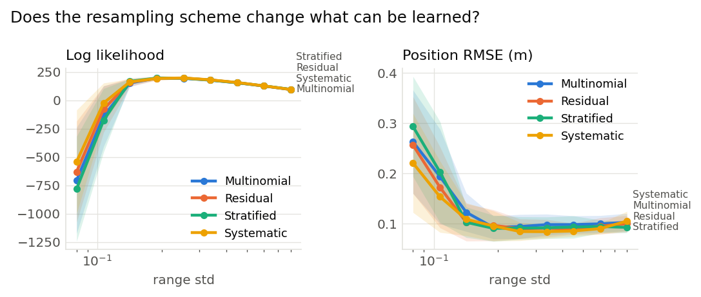
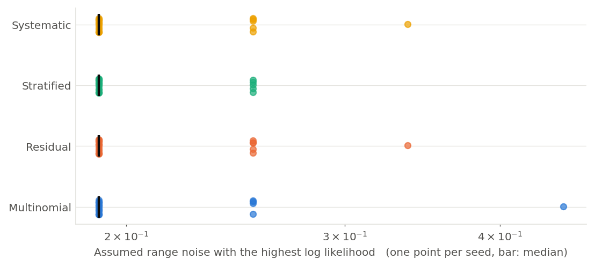

# Does the resampling scheme change what can be learned? (001)

**Question.** The same sweep of the assumed range noise under the four resampling schemes. E01 showed that they keep different numbers of distinct particles; does that carry through to the likelihood estimate and to the value it picks out?

**Hypothesis.** The schemes differ in particle diversity rather than in the weights themselves, so the estimates should be close, with the schemes that keep fewer distinct particles giving a slightly noisier likelihood.

## Setup

- Result set 001
- Filter: mcl
- Fixed: proposal = motion_model, trigger = ess_threshold (threshold=0.5), n_particles = 200, start = known, bearing_std = 0.05, forward_std = 0.005, turn_std = 0.002
- Varied: resampler: multinomial, residual, stratified, systematic; range_std: 0.08, 0.107, 0.142, 0.19, 0.253, 0.337, 0.45, 0.6, 0.8
- Seeds: 20 (each seed fixes the world and the filter's randomness, the same for every variant), 720 runs

## Results

| Resampler   |   Assumed range noise |   Seeds | Log likelihood   | Position RMSE (m)   |
|:------------|----------------------:|--------:|:-----------------|:--------------------|
| Multinomial |                 0.08  |      20 | -706 ± 1.1e+03   | 0.263 ± 0.23        |
| Multinomial |                 0.107 |      20 | -140 ± 6.1e+02   | 0.194 ± 0.22        |
| Multinomial |                 0.142 |      20 | 153 ± 73         | 0.123 ± 0.087       |
| Multinomial |                 0.19  |      20 | 197 ± 26         | 0.0929 ± 0.052      |
| Multinomial |                 0.253 |      20 | 194 ± 19         | 0.0945 ± 0.055      |
| Multinomial |                 0.337 |      20 | 178 ± 14         | 0.0983 ± 0.048      |
| Multinomial |                 0.45  |      20 | 155 ± 8.6        | 0.0984 ± 0.04       |
| Multinomial |                 0.6   |      20 | 127 ± 8.3        | 0.0999 ± 0.038      |
| Multinomial |                 0.8   |      20 | 95.9 ± 8.5       | 0.103 ± 0.04        |
| Residual    |                 0.08  |      20 | -630 ± 1e+03     | 0.257 ± 0.22        |
| Residual    |                 0.107 |      20 | -77.5 ± 4.7e+02  | 0.173 ± 0.18        |
| Residual    |                 0.142 |      20 | 160 ± 88         | 0.103 ± 0.085       |
| Residual    |                 0.19  |      20 | 194 ± 38         | 0.097 ± 0.071       |
| Residual    |                 0.253 |      20 | 197 ± 16         | 0.0901 ± 0.045      |
| Residual    |                 0.337 |      20 | 180 ± 8.9        | 0.0911 ± 0.04       |
| Residual    |                 0.45  |      20 | 156 ± 6.2        | 0.0898 ± 0.025      |
| Residual    |                 0.6   |      20 | 126 ± 7.7        | 0.0956 ± 0.037      |
| Residual    |                 0.8   |      20 | 96.4 ± 6.6       | 0.0999 ± 0.038      |
| Stratified  |                 0.08  |      20 | -781 ± 1.1e+03   | 0.294 ± 0.23        |
| Stratified  |                 0.107 |      20 | -176 ± 6.4e+02   | 0.203 ± 0.23        |
| Stratified  |                 0.142 |      20 | 167 ± 56         | 0.103 ± 0.069       |
| Stratified  |                 0.19  |      20 | 197 ± 30         | 0.091 ± 0.059       |
| Stratified  |                 0.253 |      20 | 196 ± 17         | 0.0913 ± 0.052      |
| Stratified  |                 0.337 |      20 | 179 ± 14         | 0.092 ± 0.049       |
| Stratified  |                 0.45  |      20 | 156 ± 11         | 0.0935 ± 0.051      |
| Stratified  |                 0.6   |      20 | 128 ± 6.2        | 0.0946 ± 0.029      |
| Stratified  |                 0.8   |      20 | 97.3 ± 6.5       | 0.0929 ± 0.024      |
| Systematic  |                 0.08  |      20 | -543 ± 1e+03     | 0.221 ± 0.22        |
| Systematic  |                 0.107 |      20 | -23.3 ± 4e+02    | 0.154 ± 0.16        |
| Systematic  |                 0.142 |      20 | 163 ± 58         | 0.109 ± 0.075       |
| Systematic  |                 0.19  |      20 | 194 ± 39         | 0.0957 ± 0.069      |
| Systematic  |                 0.253 |      20 | 197 ± 15         | 0.0846 ± 0.042      |
| Systematic  |                 0.337 |      20 | 181 ± 8.1        | 0.0843 ± 0.03       |
| Systematic  |                 0.45  |      20 | 157 ± 6.8        | 0.0857 ± 0.025      |
| Systematic  |                 0.6   |      20 | 128 ± 6.8        | 0.0904 ± 0.025      |
| Systematic  |                 0.8   |      20 | 96.1 ± 7.2       | 0.105 ± 0.044       |

Mean ± standard deviation over seeds.

## Estimate from each recording on its own

| Resampler   |   Seeds |   Best assumed range noise (median) | Range over seeds   | Seeds at the median   |
|:------------|--------:|------------------------------------:|:-------------------|:----------------------|
| Multinomial |      20 |                                0.19 | 0.19 to 0.45       | 15 of 20              |
| Residual    |      20 |                                0.19 | 0.19 to 0.337      | 14 of 20              |
| Stratified  |      20 |                                0.19 | 0.19 to 0.253      | 15 of 20              |
| Systematic  |      20 |                                0.19 | 0.19 to 0.337      | 14 of 20              |

The value of the swept setting with the highest log likelihood within each seed's runs.

## Findings (computed automatically)

- At every range std: no difference beyond the seed-to-seed spread in Log likelihood and Position RMSE.

## Figures

