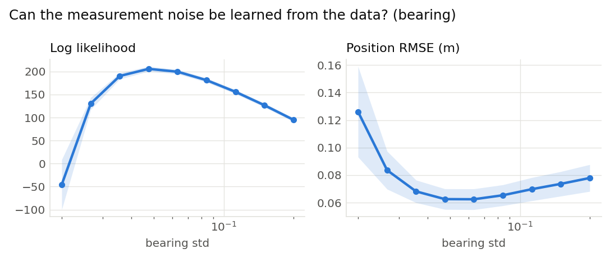
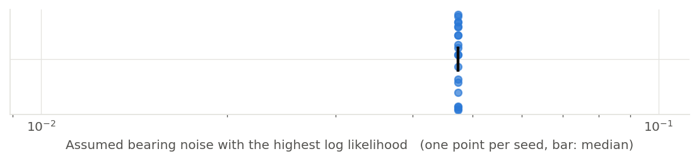

# Can the measurement noise be learned from the data? (bearing) (001)

**Question.** The same question for the bearing sensor: does the marginal likelihood of the recorded measurements peak at the bearing noise the world actually used (0.05 rad)?

**Hypothesis.** As for the range, the likelihood peaks at the true value, and more sharply, because every step measures the bearing to all four landmarks.

## Setup

- Result set 001
- Filter: mcl
- Fixed: proposal = motion_model, resampler = systematic, trigger = ess_threshold (threshold=0.5), n_particles = 2000, start = known, range_std = 0.2, forward_std = 0.005, turn_std = 0.002
- Varied: bearing_std: 0.02, 0.0267, 0.0356, 0.0474, 0.0632, 0.0843, 0.1125, 0.15, 0.2
- Seeds: 20 (each seed fixes the world and the filter's randomness, the same for every variant), 180 runs

## Results

|   Variant |   Seeds | Log likelihood   | Position RMSE (m)   |
|----------:|--------:|:-----------------|:--------------------|
|    0.02   |      20 | -45.8 ± 1.2e+02  | 0.126 ± 0.075       |
|    0.0267 |      20 | 130 ± 30         | 0.0836 ± 0.031      |
|    0.0356 |      20 | 190 ± 15         | 0.0682 ± 0.019      |
|    0.0474 |      20 | 206 ± 12         | 0.0626 ± 0.017      |
|    0.0632 |      20 | 200 ± 11         | 0.0624 ± 0.017      |
|    0.0843 |      20 | 181 ± 10         | 0.0653 ± 0.017      |
|    0.1125 |      20 | 156 ± 10         | 0.0698 ± 0.019      |
|    0.15   |      20 | 127 ± 9.9        | 0.0736 ± 0.02       |
|    0.2    |      20 | 95.1 ± 9.8       | 0.0779 ± 0.022      |

Mean ± standard deviation over seeds.

## Estimate from each recording on its own

|   Seeds |   Best assumed bearing noise (median) | Range over seeds   | Seeds at the median   |
|--------:|--------------------------------------:|:-------------------|:----------------------|
|      20 |                                0.0474 | 0.0474 to 0.0474   | 20 of 20              |

The value of the swept setting with the highest log likelihood within each seed's runs.

## Findings (computed automatically)

- clear differences in Log likelihood (0.0474 206 vs 0.02 -45.8, 549%) and Position RMSE (0.0632 0.0624 vs 0.02 0.126, 50%).

## Figures

