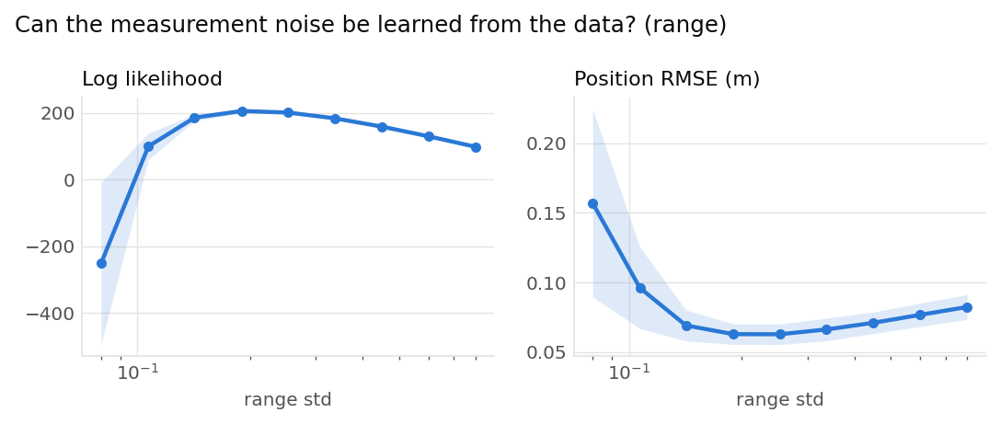
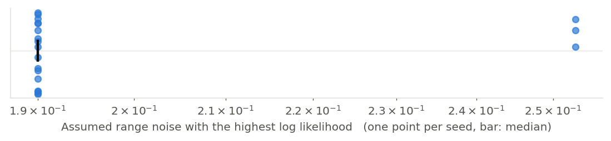

# Can the measurement noise be learned from the data? (range) (001)

**Question.** The filter is told how noisy its range sensor is. Sweeping that assumption and scoring each value by the marginal likelihood of the recorded measurements, does the best-scoring value match the noise the world actually used (0.2 m), and does it agree with the value that gives the lowest error?

**Hypothesis.** The likelihood peaks at the true value: assuming too little noise makes real measurements look impossible, assuming too much makes every pose look equally good. The lowest error may sit elsewhere, since a filter with too few particles is helped by a wider assumed noise.

## Setup

- Result set 001
- Filter: mcl
- Fixed: proposal = motion_model, resampler = systematic, trigger = ess_threshold (threshold=0.5), n_particles = 2000, start = known, bearing_std = 0.05, forward_std = 0.005, turn_std = 0.002
- Varied: range_std: 0.08, 0.107, 0.142, 0.19, 0.253, 0.337, 0.45, 0.6, 0.8
- Seeds: 20 (each seed fixes the world and the filter's randomness, the same for every variant), 180 runs

## Results

|   Variant |   Seeds | Log likelihood   | Position RMSE (m)   |
|----------:|--------:|:-----------------|:--------------------|
|     0.08  |      20 | -252 ± 5.6e+02   | 0.157 ± 0.15        |
|     0.107 |      20 | 99.1 ± 90        | 0.0961 ± 0.067      |
|     0.142 |      20 | 185 ± 24         | 0.0692 ± 0.025      |
|     0.19  |      20 | 205 ± 13         | 0.0629 ± 0.017      |
|     0.253 |      20 | 201 ± 8.7        | 0.0629 ± 0.017      |
|     0.337 |      20 | 183 ± 6.5        | 0.0663 ± 0.018      |
|     0.45  |      20 | 158 ± 5.7        | 0.0711 ± 0.018      |
|     0.6   |      20 | 129 ± 5.6        | 0.0768 ± 0.019      |
|     0.8   |      20 | 98 ± 5.7         | 0.0824 ± 0.02       |

Mean ± standard deviation over seeds.

## Estimate from each recording on its own

|   Seeds |   Best assumed range noise (median) | Range over seeds   | Seeds at the median   |
|--------:|------------------------------------:|:-------------------|:----------------------|
|      20 |                                0.19 | 0.19 to 0.253      | 17 of 20              |

The value of the swept setting with the highest log likelihood within each seed's runs.

## Findings (computed automatically)

- clear differences in Log likelihood (0.19 205 vs 0.08 -252, 182%) and Position RMSE (0.253 0.0629 vs 0.08 0.157, 60%).

## Figures

