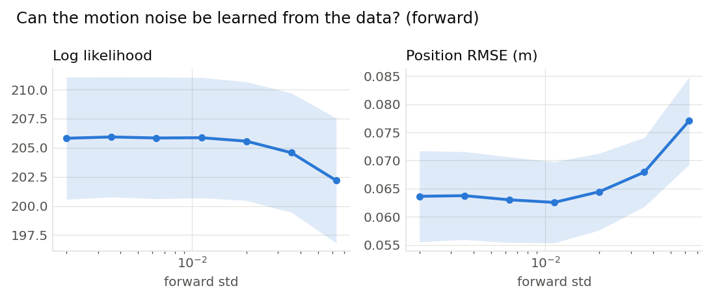
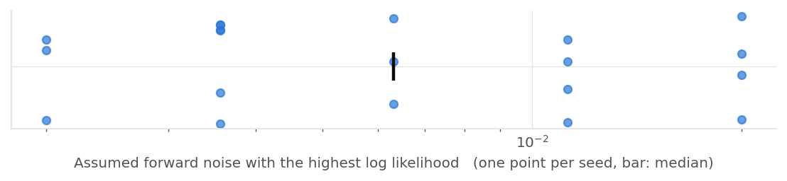

# Can the motion noise be learned from the data? (forward) (001)

**Question.** Sweeping the forward slip the filter assumes, does the marginal likelihood pick out the value the world actually used (0.005 m per step)?

**Hypothesis.** Over 30 steps the true slip is small next to the measurement noise, so the recorded measurements hardly depend on it and the likelihood is flat: the parameter is in the model but the data says little about it.

## Setup

- Result set 001
- Filter: mcl
- Fixed: proposal = motion_model, resampler = systematic, trigger = ess_threshold (threshold=0.5), n_particles = 2000, start = known, range_std = 0.2, bearing_std = 0.05, turn_std = 0.002
- Varied: forward_std: 0.002, 0.00356, 0.00632, 0.01125, 0.02, 0.0356, 0.0632
- Seeds: 20 (each seed fixes the world and the filter's randomness, the same for every variant), 140 runs

## Results

|   Variant |   Seeds | Log likelihood   | Position RMSE (m)   |
|----------:|--------:|:-----------------|:--------------------|
|   0.002   |      20 | 206 ± 12         | 0.0636 ± 0.018      |
|   0.00356 |      20 | 206 ± 12         | 0.0638 ± 0.018      |
|   0.00632 |      20 | 206 ± 12         | 0.063 ± 0.017       |
|   0.01125 |      20 | 206 ± 12         | 0.0626 ± 0.016      |
|   0.02    |      20 | 206 ± 12         | 0.0645 ± 0.016      |
|   0.0356  |      20 | 205 ± 12         | 0.0679 ± 0.014      |
|   0.0632  |      20 | 202 ± 12         | 0.0771 ± 0.018      |

Mean ± standard deviation over seeds.

## Estimate from each recording on its own

|   Seeds |   Best assumed forward noise (median) | Range over seeds   | Seeds at the median   |
|--------:|--------------------------------------:|:-------------------|:----------------------|
|      20 |                               0.00632 | 0.002 to 0.02      | 3 of 20               |

The value of the swept setting with the highest log likelihood within each seed's runs.

## Findings (computed automatically)

- no difference beyond the seed-to-seed spread in Log likelihood and Position RMSE.

## Figures

