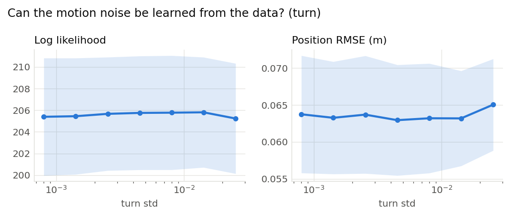
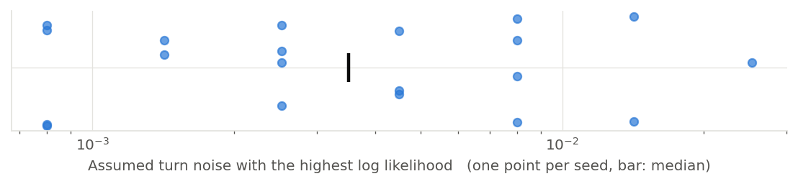

# Can the motion noise be learned from the data? (turn) (001)

**Question.** Sweeping the heading drift the filter assumes, does the marginal likelihood pick out the value the world actually used (0.002 rad per step)?

**Hypothesis.** As for the forward slip, 30 steps of a nearly straight drive leave almost no trace of a drift this small, so the likelihood is flat and the value cannot be read off it.

## Setup

- Result set 001
- Filter: mcl
- Fixed: proposal = motion_model, resampler = systematic, trigger = ess_threshold (threshold=0.5), n_particles = 2000, start = known, range_std = 0.2, bearing_std = 0.05, forward_std = 0.005
- Varied: turn_std: 0.0008, 0.00142, 0.00253, 0.0045, 0.008, 0.0142, 0.0253
- Seeds: 20 (each seed fixes the world and the filter's randomness, the same for every variant), 140 runs

## Results

|   Variant |   Seeds | Log likelihood   | Position RMSE (m)   |
|----------:|--------:|:-----------------|:--------------------|
|   0.0008  |      20 | 205 ± 12         | 0.0637 ± 0.018      |
|   0.00142 |      20 | 205 ± 12         | 0.0633 ± 0.017      |
|   0.00253 |      20 | 206 ± 12         | 0.0637 ± 0.018      |
|   0.0045  |      20 | 206 ± 12         | 0.0629 ± 0.017      |
|   0.008   |      20 | 206 ± 12         | 0.0632 ± 0.017      |
|   0.0142  |      20 | 206 ± 12         | 0.0632 ± 0.015      |
|   0.0253  |      20 | 205 ± 12         | 0.065 ± 0.014       |

Mean ± standard deviation over seeds.

## Estimate from each recording on its own

|   Seeds |   Best assumed turn noise (median) | Range over seeds   | Seeds at the median   |
|--------:|-----------------------------------:|:-------------------|:----------------------|
|      20 |                           0.003515 | 0.0008 to 0.0253   | 0 of 20               |

The value of the swept setting with the highest log likelihood within each seed's runs.

## Findings (computed automatically)

- no difference beyond the seed-to-seed spread in Log likelihood and Position RMSE.

## Figures

