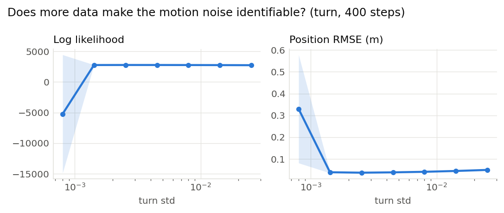
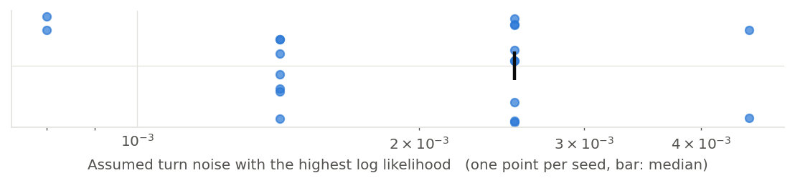

# Does more data make the motion noise identifiable? (turn, 400 steps) (001)

**Question.** The same sweep as the 30-step run, on a trajectory of 400 steps and with nothing else changed. Does the flat likelihood become a peak at the true heading drift (0.002 rad per step)?

**Hypothesis.** Every step contributes evidence about the same parameter, so a longer trajectory sharpens the likelihood; too small a drift becomes very unlikely first, since the particles then cannot follow the robot at all.

## Setup

- Result set 001
- Filter: mcl, world settings: {'n_steps': 400}
- Fixed: proposal = motion_model, resampler = systematic, trigger = ess_threshold (threshold=0.5), n_particles = 1000, start = known, range_std = 0.2, bearing_std = 0.05, forward_std = 0.005
- Varied: turn_std: 0.0008, 0.00142, 0.00253, 0.0045, 0.008, 0.0142, 0.0253
- Seeds: 20 (each seed fixes the world and the filter's randomness, the same for every variant), 140 runs

## Results

|   Variant |   Seeds | Log likelihood      | Position RMSE (m)   |
|----------:|--------:|:--------------------|:--------------------|
|   0.0008  |      20 | -5.22e+03 ± 2.2e+04 | 0.33 ± 0.57         |
|   0.00142 |      20 | 2.77e+03 ± 60       | 0.0389 ± 0.008      |
|   0.00253 |      20 | 2.78e+03 ± 47       | 0.0369 ± 0.0043     |
|   0.0045  |      20 | 2.78e+03 ± 47       | 0.0385 ± 0.0041     |
|   0.008   |      20 | 2.77e+03 ± 47       | 0.041 ± 0.0036      |
|   0.0142  |      20 | 2.76e+03 ± 46       | 0.0449 ± 0.0033     |
|   0.0253  |      20 | 2.75e+03 ± 47       | 0.0496 ± 0.003      |

Mean ± standard deviation over seeds.

## Estimate from each recording on its own

|   Seeds |   Best assumed turn noise (median) | Range over seeds   | Seeds at the median   |
|--------:|-----------------------------------:|:-------------------|:----------------------|
|      20 |                            0.00253 | 0.0008 to 0.0045   | 9 of 20               |

The value of the swept setting with the highest log likelihood within each seed's runs.

## Findings (computed automatically)

- clear differences in Position RMSE (0.00253 0.0369 vs 0.0008 0.33, 89%).
- no difference beyond the seed-to-seed spread in Log likelihood.

## Figures

